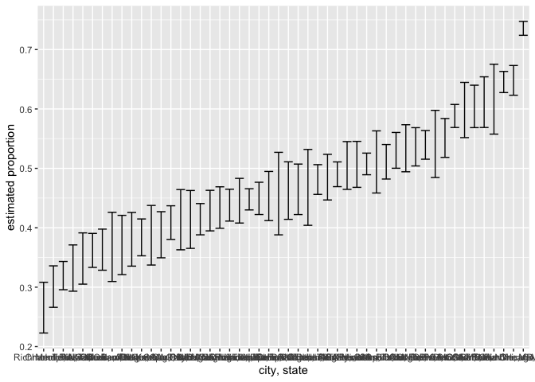
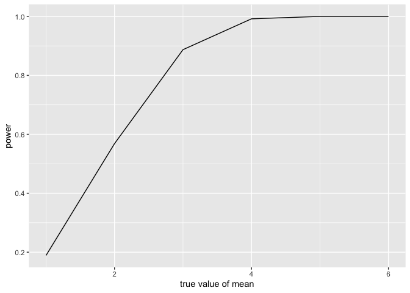
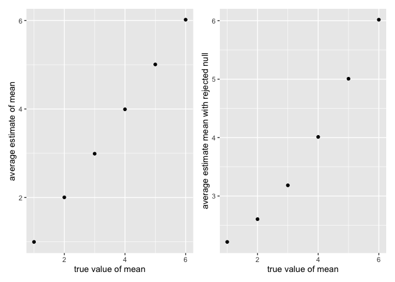

p8105_hw5_jq2342.Rmd
================
Junyu QI
2022-11-16

## Homework 5

``` r
library(tidyverse)
```

    ## ── Attaching packages ─────────────────────────────────────── tidyverse 1.3.2 ──
    ## ✔ ggplot2 3.3.6      ✔ purrr   0.3.4 
    ## ✔ tibble  3.1.8      ✔ dplyr   1.0.10
    ## ✔ tidyr   1.2.1      ✔ stringr 1.4.1 
    ## ✔ readr   2.1.2      ✔ forcats 0.5.2 
    ## ── Conflicts ────────────────────────────────────────── tidyverse_conflicts() ──
    ## ✖ dplyr::filter() masks stats::filter()
    ## ✖ dplyr::lag()    masks stats::lag()

``` r
library(purrr)
library(patchwork)
set.seed(1)
```

### Problem 2

> Describe the raw data. Create a `city_state` variable
> (e.g. “Baltimore, MD”) and then summarize within cities to obtain the
> total number of homicides and the number of unsolved homicides (those
> for which the disposition is “Closed without arrest” or “Open/No
> arrest”).

``` r
homicide_data=
read_csv("./data/homicide-data.csv") %>%
  janitor:: clean_names() %>%
  unite("city_state", city:state, sep=", ", remove=FALSE) %>%
  select (-city, -state)
```

    ## Rows: 52179 Columns: 12
    ## ── Column specification ────────────────────────────────────────────────────────
    ## Delimiter: ","
    ## chr (9): uid, victim_last, victim_first, victim_race, victim_age, victim_sex...
    ## dbl (3): reported_date, lat, lon
    ## 
    ## ℹ Use `spec()` to retrieve the full column specification for this data.
    ## ℹ Specify the column types or set `show_col_types = FALSE` to quiet this message.

``` r
homicide_data %>%
  group_by(city_state) %>%
  filter(disposition %in% c("Closed without arrest","Open/No arrest")) %>%
  summarize (count=n()) %>%
  knitr::kable()  
```

| city_state         | count |
|:-------------------|------:|
| Albuquerque, NM    |   146 |
| Atlanta, GA        |   373 |
| Baltimore, MD      |  1825 |
| Baton Rouge, LA    |   196 |
| Birmingham, AL     |   347 |
| Boston, MA         |   310 |
| Buffalo, NY        |   319 |
| Charlotte, NC      |   206 |
| Chicago, IL        |  4073 |
| Cincinnati, OH     |   309 |
| Columbus, OH       |   575 |
| Dallas, TX         |   754 |
| Denver, CO         |   169 |
| Detroit, MI        |  1482 |
| Durham, NC         |   101 |
| Fort Worth, TX     |   255 |
| Fresno, CA         |   169 |
| Houston, TX        |  1493 |
| Indianapolis, IN   |   594 |
| Jacksonville, FL   |   597 |
| Kansas City, MO    |   486 |
| Las Vegas, NV      |   572 |
| Long Beach, CA     |   156 |
| Los Angeles, CA    |  1106 |
| Louisville, KY     |   261 |
| Memphis, TN        |   483 |
| Miami, FL          |   450 |
| Milwaukee, wI      |   403 |
| Minneapolis, MN    |   187 |
| Nashville, TN      |   278 |
| New Orleans, LA    |   930 |
| New York, NY       |   243 |
| Oakland, CA        |   508 |
| Oklahoma City, OK  |   326 |
| Omaha, NE          |   169 |
| Philadelphia, PA   |  1360 |
| Phoenix, AZ        |   504 |
| Pittsburgh, PA     |   337 |
| Richmond, VA       |   113 |
| Sacramento, CA     |   139 |
| San Antonio, TX    |   357 |
| San Bernardino, CA |   170 |
| San Diego, CA      |   175 |
| San Francisco, CA  |   336 |
| Savannah, GA       |   115 |
| St. Louis, MO      |   905 |
| Stockton, CA       |   266 |
| Tampa, FL          |    95 |
| Tulsa, OK          |   193 |
| Washington, DC     |   589 |

The `homicide_data` dataframe contains 52179 cities and 11 variables
after merging `city` and `state` variable to create `city_state`
variable. Important variables include`victim name`, `uid`, `disposition`

> For the city of Baltimore, MD, use the `prop.test` function to
> estimate the proportion of homicides that are unsolved; save the
> output of `prop.test` as an R object, apply the `broom::tidy` to this
> object and pull the estimated proportion and confidence intervals from
> the resulting tidy dataframe.

``` r
homicide_1=
homicide_data %>%
  mutate(case_done= case_when(
        disposition %in% c("Closed without arrest","Open/No arrest") ~"unsolved",
        disposition %in% "Closed by arrest" ~"solved"))

homicide_2=homicide_1 %>%
  group_by(city_state, case_done) %>%
  summarize (count=n()) %>%
  na.omit()%>%
  pivot_wider(
    names_from = "case_done",
    values_from = "count") %>%
  mutate(total= sum(unsolved+solved))%>%
  na.omit()
```

    ## `summarise()` has grouped output by 'city_state'. You can override using the
    ## `.groups` argument.

``` r
homicide_Bal=  
  homicide_2 %>%
  filter(city_state %in% "Baltimore, MD")

homicide_Bal_stats=
  prop.test(x=pull(homicide_Bal, unsolved),
            n=pull(homicide_Bal,total),
           alternative="two.sided",
           conf.level=0.95 ) %>%
           broom::tidy() %>%
           select(conf.low,conf.high,estimate) 
```

In the tidied baltimore proportional test statistics homicide_Bal_stats,
the estimate is 0.6455607 , the confidence interval is 0.6275625
0.6631599

> Now run `prop.test` for each of the cities in your dataset, and
> extract both the proportion of unsolved homicides and the confidence
> interval for each. Do this within a “tidy” pipeline, making use
> of `purrr::map`, `purrr::map2`, list columns and `unnest` as necessary
> to create a tidy dataframe with estimated proportions and CIs for each
> city.

``` r
proptest=function(d){
  unsolved=d$unsolved
  total=d$total
  prop.test(x=unsolved,
            n=total,
            alternative="two.sided",
            conf.level=0.95 ) %>%
    broom::tidy() %>%
    select(conf.low,conf.high,estimate)
}

 homicide_final =
   homicide_2 %>% 
  mutate(proportion = map2(unsolved, total, prop.test),
         proportion = map(proportion, broom::tidy)) %>% 
  unnest(proportion) %>%
   select (city_state, estimate, conf.low, conf.high)
```

> > Create a plot that shows the estimates and CIs for each city – check
> > out `geom_errorbar` for a way to add error bars based on the upper
> > and lower limits. Organize cities according to the proportion of
> > unsolved homicides.

``` r
  homicide_final %>%
  ggplot(aes(fct_reorder(city_state,estimate), estimate))+
  geom_errorbar(aes(ymin=conf.low, ymax=conf.high))+
  labs(
    x="city, state",
    y="estimated proportion"
  )
```

<!-- -->

### Problem 3

> For each dataset, save μ̂ and the p-value arising from a test
> of H:μ=0 using α=0.05. *Hint: to obtain the estimate and p-value,
> use `broom::tidy` to clean the output of `t.test`.*

``` r
func3 = function(mu, n=30, sigma = 5) {
  sim_data = tibble(
    x = rnorm(n, mean = mu, sd = sigma),
  )
  sim_data=
    t.test(sim_data) %>%
    broom::tidy() %>%
    select(p.value, estimate)
}

sim_results_df = 
  expand_grid(
    mean=0,
    iter = 1:5000
  ) %>% 
  mutate(
    estimate_df = map(mean, func3)
  ) %>% 
  unnest(estimate_df)
```

> Repeat the above for mean={1,2,3,4,5,6}

``` r
sim_results_df2 = 
  expand_grid(
    mean=c(1,2,3,4,5,6),
    iter = 1:5000
  ) %>% 
  mutate(
    estimate_df = map(mean, func3)
  ) %>% 
  unnest(estimate_df)
```

> Make a plot showing the proportion of times the null was rejected (the
> power of the test) on the y axis and the true value of mean on the x
> axis. Describe the association between effect size and power

``` r
sim_results_df2 %>% 
  group_by(mean) %>% 
  summarize(proportion = sum(p.value < 0.05)/n()) %>% 
  ggplot(aes(x = mean, y = proportion)) +
  geom_line()+
    labs(
    x = "true value of mean",
    y = "power")
```

<!-- -->

The effect size and power are positively correlated, greater the effect,
greater the power, the power reaches the peak value 1 and plateaus when
the effect size= 4.

> Make a plot showing the average estimate of μ̂ on the y axis and the
> true value of μ on the x axis. Make a second plot (or overlay on the
> first) the average estimate of μ̂ **only in samples for which the null
> was rejected** on the y axis and the true value of μ on the x axis. Is
> the sample average of μ̂ across tests for which the null is rejected
> approximately equal to the true value of μ? Why or why not?

``` r
plot1=
sim_results_df2 %>% 
  group_by(mean) %>% 
  summarize(meanproportion = mean(estimate)) %>% 
  ggplot(aes(x = mean, y = meanproportion)) +
  geom_point()+
    labs(
    x = "true value of mean",
    y = "average estimate of mean")

plot2=
sim_results_df2 %>% 
  filter(p.value < 0.05)%>%
  group_by(mean) %>% 
  summarize(meanproportion = mean(estimate)) %>% 
  ggplot(aes(x = mean, y = meanproportion)) +
  geom_point()+
    labs(
    x = "true value of mean",
    y = "average estimate mean with rejected null")
plot1+plot2
```

<!-- -->

The average estimated means in p\<0.05 are not approximately the same as
the true value of mean. When the mean is smaller, the power would also
be smaller, this would increase the chance of type 2 error and lead to a
less accurate mean estimate.
